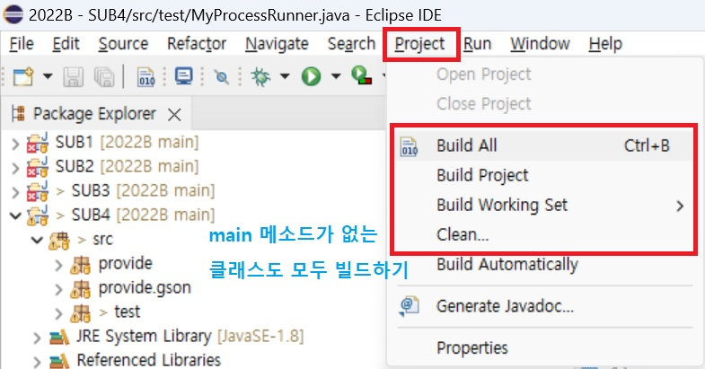

# javatest

## 참고

35.216.53.239

https://829525375625.signin.aws.amazon.com/console

## 커맨트 창에서 java 실행

```shell
java -classpath C:/workspace/javatest/bin/*;C:/workspace/javatest/lib/*;. com.test.HelloWorld
```

## Json to java class

https://jsonformatter.org/json-to-java

## eclipse 프로젝트 안에 모든 클래스 컴파일하기



## eclipse 콘솔에서 한글 안 깨지게 보기


## IntelliJ 에서 프로젝트 구조 참고


## IntelliJ 에서 run/debug 설정 참고

